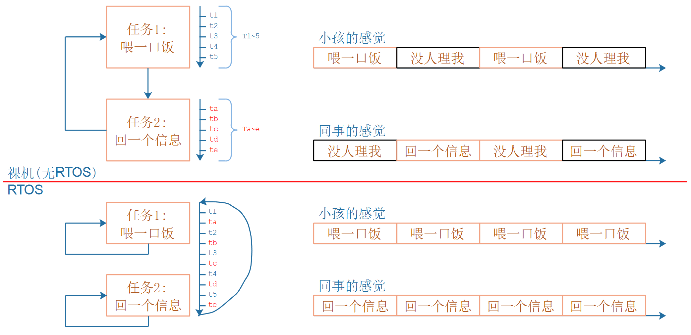
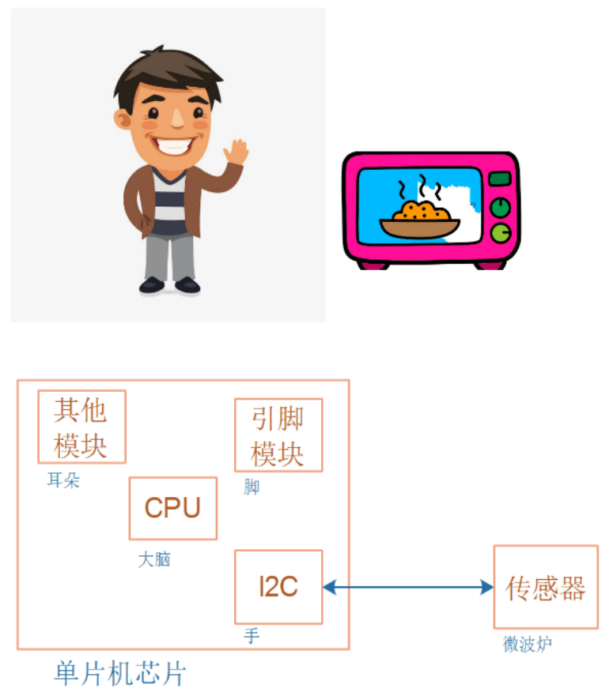

## 单片机\_RTOS\_架构

### 1. RTOS的概念


#### 1.1 用人来类比单片机程序和RTOS


妈妈要一边给小孩喂饭，一边加班跟同事微信交流，怎么办？

##### 1.1.1 我无法一心多用

对于单线条的人，不能分心、不能同时做事，她只能这样做：

* 给小孩喂一口饭
* 瞄一眼电脑，有信息就去回复
* 再回来给小孩喂一口饭
* 如果小孩吃这口饭太慢，她回复同事的信息也就慢了，被同事催：你半天都不回我？
* 如果回复同事的信息要写一大堆，小孩就着急得大哭起来。

这种做法，在软件开发上就是一般的单片机开发，没有用操作系统。


##### 1.2.2 我可以一心多用

对于眼明手快的人，她可以一心多用，她这样做：

* 左手拿勺子，给小孩喂饭
* 右手敲键盘，回复同事
* 两不耽误，小孩“以为”妈妈在专心喂饭，同事“以为”她在专心聊天
* 但是脑子只有一个啊，虽然说“一心多用”，但是谁能同时思考两件事？
* 只是她反应快，上一秒钟在考虑夹哪个菜给小孩，下一秒钟考虑给同事回复什么信息

 

这种做法，在软件开发上就是使用操作系统，在单片机里叫做使用RTOS。

RTOS的意思是：Real-time operating system，实时操作系统。

我们使用的Windows也是操作系统，被称为通用操作系统。使用Windows时，我们经常碰到程序卡死、停顿的现象，日常生活中这可以忍受。

但是在电梯系统中，你按住开门键时如果没有即刻反应，即使只是慢个1秒，也会夹住人。

在专用的电子设备中，“实时性”很重要。


#### 1.2 程序简单示例

```c
// 经典单片机程序
void main()
{
	while (1)
    {
        喂一口饭();
        回一个信息();
    }
}
------------------------------------------------------
// RTOS程序    
喂饭()
{
    while (1)
    {
        喂一口饭();
    }
}

回信息()
{
    while (1)
    {
        回一个信息();
    }
}

void main()
{
    create_task(喂饭);
    create_task(回信息);
    start_scheduler();
    while (1)
    {
        sleep();
    }
}
```




 

### 2. 架构的概念

#### 2.1 用人来类比电子产品




在电子系统中，CPU就是大脑，CPU有很多种类别，被称为架构。

常见的有：

* ARM：
  目前主流的架构，用得最广，芯片公司需要付费购买，再搭配各种模块才能设计出芯片。
  目前华为被美国制裁，无法获得最新的ARM架构；
  对于其他公司，购买ARM新架构的价格也不低。
* RISC-V：
后起之秀，开源、免费。
目前华为海思的HI3861、乐鑫的ESP32-C3等芯片，都是使用RISC-V的单片机芯片；
平头哥和全志的D1芯片，是使用RISC-V的、能运行Linux的芯片；
RISC-V作为全新的架构，没有历史包袱，设计优美，在技术上大有可为，另外它开源无需授权，能摆脱技术的卡脖子问题。

#### 2.2 要深入理解RTOS就必须深入理解CPU架构

如果只是使用别人移植好的RTOS来写程序，当然不需要了解CPU架构。

甚至编写驱动程序时，也不需要了解CPU架构：因为我们操作的是CPU之外的设备，不是操作CPU。

但是，如果你想达到如下目标，就需要先了解CPU架构：

* 深入理解RTOS的内部实现
* 移植RTOS
* 解决疑难问题